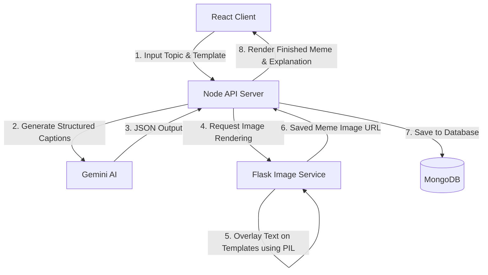

# 🧠🎭 MemeLearn: Learn with Memes!

<p align="center">
  
  
  
  
  
</p>

---

**MemeLearn** is an AI-powered educational web application designed to help students, developers, and curious minds master and retain complex topics, programming concepts, or science facts. It dynamically converts educational content into relatable, funny memes using **Gemini AI** and a custom **Python Image Processing microservice**.

---

## 🚀 Key Features

* **🤖 AI Meme Generator:** Input any topic, and Gemini AI will curate custom, witty text tailored to standard meme templates.
* **🖼️ Multi-Template Support:** 
  * 🙅‍♂️ **Drake Hotline Bling** (Misconception vs. Correct Concept)
  * 🧑‍🤝‍🧑 **Distracted Boyfriend** (Tempting Misconception vs. Core Fact)
  * 🧠 **Expanding Brain** (4-stage escalation of understanding)
* **📚 Dashboard & History:** Keep track of your learning milestones and save your generated memes to MongoDB.
* **⚡ Modern UI/UX:** Stunning dark theme styling, glassmorphism, and responsive design powered by Tailwind CSS.

---

## 🛠️ Architecture Flow



---

## 📋 Prerequisites

Ensure you have the following installed locally:
* **Node.js** 🟢 (v18.x or above)
* **Python** 🐍 (v3.8 or above)
* **MongoDB** 🍃 (Running locally on default port `27017`)

---

## ⚙️ Installation & Setup

### 1️⃣ Clone the Repository
```bash
git clone https://github.com/aiml-athrav/memeLearn.git
cd hackathon
```

### 2️⃣ Configure Environment Variables (`.env`)
Create a `.env` file in the root folder:
```env
GEMINI_API_KEY=your_gemini_api_key_here
PORT=5002
MONGODB_URI=mongodb://127.0.0.1:27017/memelearn
```

### 3️⃣ Install Frontend & Node Backend Dependencies
```bash
npm install
```

### 4️⃣ Set up Python Virtual Environment & Flask Dependencies
```bash
cd image_service
python3 -m venv venv

# Activate Virtual Env
source venv/bin/activate  # On macOS/Linux
# venv\Scripts\activate.bat # On Windows CMD
# .\venv\Scripts\Activate.ps1 # On Windows PowerShell

# Install Packages
pip install -r requirements.txt
cd ..
```

---

## 🏃‍♂️ Running the Application

To run the full stack, you need to open **three separate terminals** and run these services:

### 🍃 Start MongoDB
Ensure MongoDB is running in the background.
```bash
# macOS
brew services start mongodb-community
```

### 🐍 Terminal 1: Flask Image Service (Port 5001)
```bash
cd image_service
source venv/bin/activate
python app.py
```

### 🟢 Terminal 2: Node.js API Server (Port 5002)
```bash
npm run server
```

### ⚡ Terminal 3: Vite Dev Server (Port 5173)
```bash
npm run dev
```

Open **[http://localhost:5173](http://localhost:5173)** in your browser and start learning with memes! 🚀
